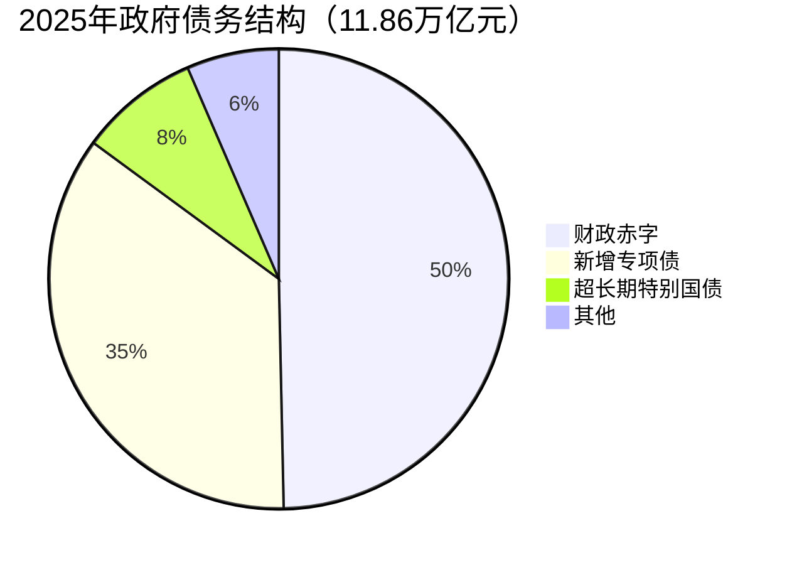
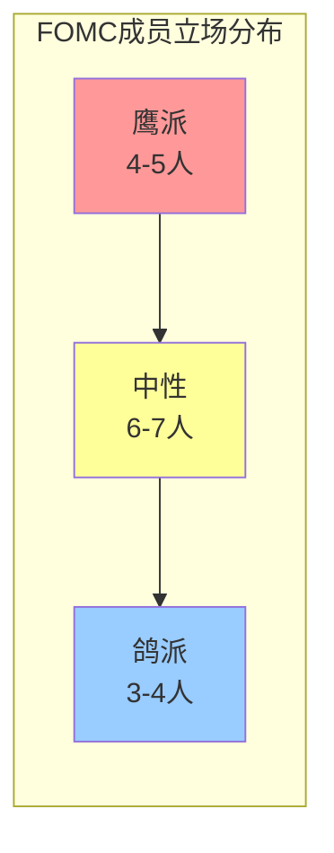
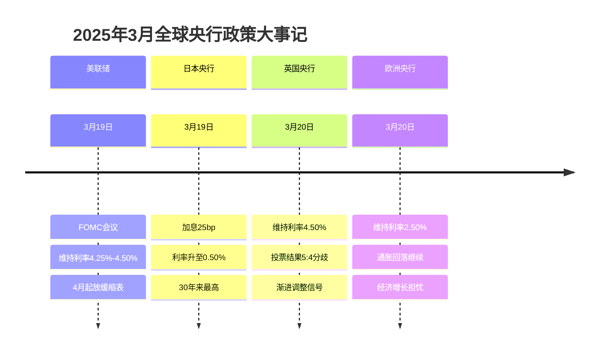
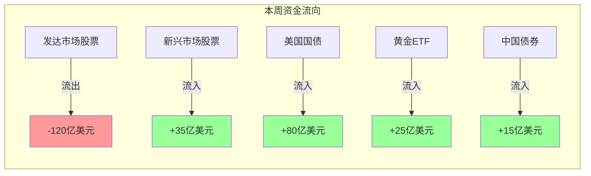
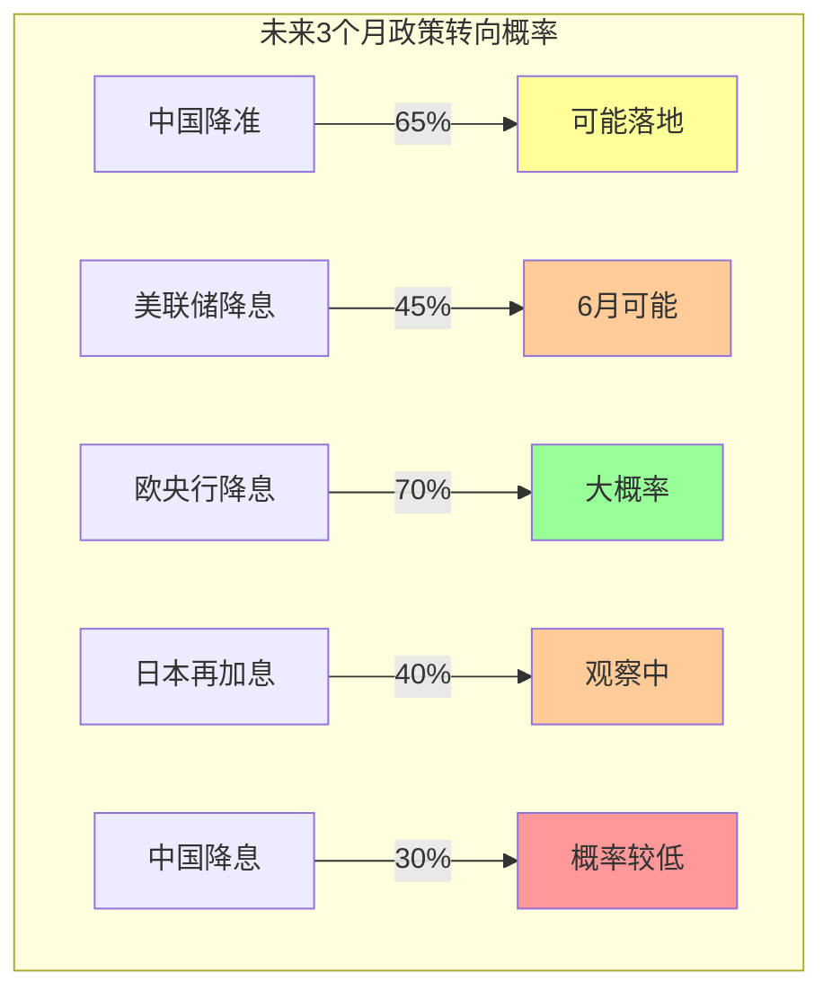

# 📊 宏观经济政策周度趋势分析报告

**报告周期：2026年3月30日 - 4月3日（第14周）**

**发布日期：2026年4月3日**

---

## 📌 本周核心结论

### 政策基调总览

| 政策领域 | 周初基调 | 周末基调 | 变化方向 | 转向信号 |
|:--------:|:--------:|:--------:|:--------:|:--------:|
| **中国货币政策** | 稳健偏松 | 稳健偏松 | → 持平 | ⚠️ 观察中 |
| **中国财政政策** | 积极发力 | 积极发力 | → 持平 | ✅ 已确认 |
| **美联储政策** | 观望等待 | 观望等待 | → 持平 | ⚠️ 观察中 |
| **全球央行** | 分化加剧 | 分化加剧 | → 持续 | ✅ 已确认 |

### 关键变化速览

🔴 **重要发现**：本周全球宏观政策呈现"稳中有变"的特征——表面上的政策利率维持不变掩盖了深层的政策取向调整信号。

1. **中国PMI数据验证复苏韧性**：官方制造业PMI升至50.5%，财新PMI升至51.2%，双双确认经济处于扩张通道，但中小企业景气度分化依然明显
2. **美联储缩表放缓落地**：4月起国债减持上限从250亿降至50亿美元/月，流动性管理进入新阶段
3. **关税政策不确定性攀升**：特朗普政府对等关税政策进入实施倒计时，全球市场避险情绪升温
4. **日本央行鹰派立场强化**：3月加息25bp至0.50%，与其他主要央行形成鲜明对比

### 政策转向信号矩阵

```mermaid
graph TB
    subgraph 已确认信号 ✅
        A1[美联储缩表放缓] --> A2[4月起国债减持上限降至50亿/月]
        B1[日本加息落地] --> B2[利率升至0.50% 30年新高]
        C1[中国财政前置发力] --> C2[3月政府债券净融资1.7万亿]
    end

    subgraph 观察中信号 ⚠️
        D1[中国降准预期] --> D2[二季度存在落地可能]
        E1[美联储降息时点] --> E2[6-7月首次降息概率上升]
        F1[关税政策冲击] --> F2[4月9日起对华关税生效]
    end

    subgraph 证伪信号 ❌
        G1[LPR下调预期] --> G2[3月LPR连续10月不变]
        H1[欧央行3月降息] --> H2[维持2.50%不变]
    end
```

---

## 🇨🇳 中国政策周度观察

### 一、货币政策轨迹：稳健基调下的结构性宽松

#### 1.1 政策利率维持不变

| 政策工具 | 3月数值 | 变化 | 连续不变期 |
|:--------:|:-------:|:----:|:----------:|
| 1年期LPR | 3.10% | 维持 | 10个月 |
| 5年期以上LPR | 3.60% | 维持 | 10个月 |
| 大型银行准备金率 | 8.0% | 维持 | - |
| 中小银行准备金率 | 6.0% | 维持 | - |

**政策解读**：LPR连续10个月"按兵不动"反映央行在多重目标间的审慎平衡。当前银行净息差已压缩至历史低位（约1.5%），进一步下调LPR的空间受限。但央行通过MLF净投放500亿元、公开市场国债买卖净投放500亿元等结构性工具，保持流动性合理充裕。

#### 1.2 流动性管理动态

| 工具 | 3月操作 | 净投放/回笼 | 政策含义 |
|:----:|:-------:|:-----------:|:---------|
| MLF | 投放4500亿元 | 净投放+500亿 | 展现宽松取向 |
| 逆回购 | 7天期操作 | 净回笼-890亿 | 季节性调节 |
| 国债买卖 | 公开市场 | 净投放+500亿 | 流动性补充 |
| SLF | 常备借贷便利 | 净投放+8亿 | 应急流动性 |

**关键变化**：3月25日央行调整MLF操作方式，采用多重价位中标，标志着MLF利率政策属性完全淡出，7天逆回购利率成为唯一政策利率的框架正式确立。

### 二、财政政策动态：前置发力特征明显

#### 2.1 政府债券发行节奏

| 指标 | 2月数据 | 同比变化 | 政策含义 |
|:----:|:-------:|:--------:|:---------|
| 政府债券净融资 | 1.7万亿元 | 多增1.1万亿 | 财政前置发力 |
| 新增专项债 | 累计发行约8000亿 | 进度快于往年 | 基建投资支撑 |
| 超长期特别国债 | 待发行 | 规模预计1万亿 | 重大项目资金 |

#### 2.2 2025年财政赤字安排



**政策取向**：赤字率按4%左右安排，突破3%传统警戒线，体现财政政策"更加积极有为"的取向。政府债券加速发行支撑社融保持较快增长，显示财政政策正在前置发力。

### 三、实体经济数据验证

#### 3.1 PMI数据解读

| 指标 | 3月数值 | 环比变化 | 趋势判断 |
|:----:|:-------:|:--------:|:--------:|
| 官方制造业PMI | 50.5% | +0.3pp | ✅ 扩张加速 |
| 财新制造业PMI | 51.2% | +0.4pp | ✅ 四个月新高 |
| 官方非制造业PMI | 50.8% | - | ✅ 保持扩张 |
| 财新服务业PMI | 51.9% | +0.5pp | ✅ 扩张改善 |

#### 3.2 企业规模分化

```mermaid
xychart-beta
    title "3月制造业PMI按企业规模分布"
    x-axis [大型企业, 中型企业, 小型企业]
    y-axis "PMI指数" 48 --> 52
    bar [51.2, 49.9, 49.6]
    line [50, 50, 50]
```

**关键观察**：
- **大型企业**（51.2%）：景气度较高，但环比下降1.3个百分点，扩张动能边际减弱
- **中型企业**（49.9%）：处于临界点附近，环比改善0.7个百分点
- **小型企业**（49.6%）：仍处收缩区间，但环比大幅改善3.3个百分点

**政策含义**：中小企业景气度改善但仍偏弱，结构性支持政策需持续发力。

#### 3.3 通胀与价格指标

| 指标 | 3月数据 | 趋势 | 政策含义 |
|:----:|:-------:|:----:|:---------|
| CPI同比 | 温和 | 稳定 | 通胀压力可控 |
| PPI同比 | -2.5% | 降幅扩大 | 工业需求仍偏弱 |
| 原材料购进价格 | 49.8% | 下降1.0pp | 成本压力缓解 |
| 出厂价格 | 47.9% | 下降0.6pp | 企业盈利承压 |

---

## 🇺🇸 美联储周度追踪

### 一、3月议息会议核心决议落地

#### 1.1 利率决议与政策调整

| 政策工具 | 调整内容 | 生效时间 | 政策取向 |
|:--------:|:---------|:--------:|:--------:|
| 联邦基金利率 | 维持4.25%-4.50% | 即时 | 观望 |
| 国债减持上限 | 从250亿→50亿美元/月 | 2025年4月 | 偏鸽 |
| MBS减持上限 | 维持350亿美元/月 | 不变 | 中性 |

#### 1.2 经济预测摘要（SEP）变化

| 指标 | 2025年预测 | 此前预测 | 变化方向 |
|:----:|:----------:|:--------:|:--------:|
| GDP增速 | 1.7% | 2.1% | ↓ 下调 |
| 核心PCE通胀 | 2.7% | 2.5% | ↑ 上调 |
| 失业率 | 4.3% | 4.3% | → 持平 |
| 联邦基金利率 | 3.9% | 3.9% | → 持平 |

**解读**：美联储下调增长预期、上调通胀预期，呈现"滞胀"担忧升温的特征。但利率路径预期保持不变，显示联储认为当前政策利率足以应对经济前景变化。

### 二、Hawk-Dove指数监测

#### 2.1 鲍威尔讲话立场分析

| 议题 | 鲍威尔立场 | 鹰鸽倾向 | 信号强度 |
|:----:|:-----------|:--------:|:--------:|
| 降息时机 | "不急于降息，需观察数据" | 🦅 偏鹰 | ⭐⭐⭐ |
| 缩表政策 | "4月起放缓缩表" | 🕊️ 偏鸽 | ⭐⭐ |
| 通胀评估 | "仍高于目标，但有降温趋势" | ⚖️ 中性 | ⭐⭐ |
| 就业市场 | "就业市场稳健，不担心衰退" | 🦅 偏鹰 | ⭐⭐⭐ |
| 关税影响 | "政策不确定性高，需持续观察" | ⚖️ 中性 | ⭐⭐ |

#### 2.2 FOMC内部立场分布



**判断依据**：
- **鹰派**：强调通胀风险、支持延迟降息（如Bowman、Waller）
- **中性**：数据依赖、灵活应对（鲍威尔、Williams）
- **鸽派**：担忧就业下行风险、支持提前降息（如Goolsbee）

### 三、利率预期变化追踪

#### 3.1 CME FedWatch Tool数据

| 会议时间 | 维持不变概率 | 降息25bp概率 | 加息概率 | 市场共识 |
|:--------:|:------------:|:------------:|:--------:|:--------:|
| 2025年5月 | 85% | 15% | <1% | 维持不变 |
| 2025年6月 | 55% | 45% | <1% | 可能降息 |
| 2025年7月 | 35% | 60% | 5% | 大概率降息 |
| 2025年12月 | - | - | - | 累计降息2-3次 |

#### 3.2 利率预期周度变化

```mermaid
xychart-beta
    title "2025年美联储利率预期路径变化"
    x-axis [3月会议前, 3月会议后, 当前预期]
    y-axis "年末利率预期(%)" 3.5 --> 4.5
    line [3.9, 3.9, 3.75]
```

**关键变化**：
- **3月会议前**：市场预期2025年降息3次
- **3月会议后**：点阵图显示降息2次
- **当前预期**：受关税政策不确定性影响，市场重新定价降息3次可能

### 四、美国经济数据周度对比

#### 4.1 通胀数据

| 指标 | 2月数据 | 1月数据 | 趋势判断 |
|:----:|:-------:|:-------:|:--------:|
| CPI同比 | +2.8% | +3.0% | ✅ 降温 |
| 核心CPI同比 | +3.1% | +3.3% | ✅ 粘性但回落 |
| CPI环比 | +0.2% | +0.5% | ✅ 温和 |

#### 4.2 就业市场

| 指标 | 2月数据 | 1月数据 | 趋势判断 |
|:----:|:-------:|:-------:|:--------:|
| 非农就业新增 | 15.1万 | 14.3万 | ⚠️ 放缓 |
| 失业率 | 4.1% | 4.0% | ⚠️ 微升 |
| 平均时薪环比 | +0.3% | +0.4% | ✅ 温和 |

---

## 🌍 全球央行动态矩阵

### 一、主要央行政策一览

| 央行 | 当前利率 | 3月决议 | 年内预期 | 政策取向 | 影响评级 |
|:----:|:--------:|:-------:|:--------:|:--------:|:--------:|
| **美联储** | 4.25%-4.50% | 维持不变 | 降息2-3次 | 观望 | 🔴 高 |
| **欧洲央行** | 2.50% | 维持不变 | 继续降息 | 偏鸽 | 🟡 中 |
| **英国央行** | 4.50% | 维持不变 | 渐进降息 | 观望 | 🟡 中 |
| **日本央行** | 0.50% | 加息25bp | 再加息1-2次 | 鹰派 | 🔴 高 |
| **瑞士央行** | 0.25% | 降息25bp | 可能再降 | 偏鸽 | 🟢 低 |

### 二、央行政策分化趋势



### 三、重点央行深度分析

#### 3.1 日本央行：鹰派立场强化

**政策行动**：3月加息25bp至0.50%，为2008年以来最高利率水平

**政策背景**：
- 日本通胀持续高于2%目标（核心CPI约3%）
- 春季工资谈判结果强劲（工资涨幅约5%）
- 经济摆脱通缩螺旋的确定性增强

**市场影响**：
- 日元短期走强，USD/JPY跌破150关口
- 日债收益率上升，10年期突破1.5%
- 套息交易平仓压力显现

**后续预期**：市场预计年内可能再加息1-2次，终端利率预期升至0.75%-1.00%

#### 3.2 欧洲央行：鸽派取向延续

**政策立场**：维持主要再融资利率在2.50%不变

**关键信号**：
- 拉加德强调"通胀回落进程仍在继续"
- 承认"经济增长面临下行风险"
- 货币政策将保持"数据依赖"

**市场预期**：年内可能再降息2-3次，终端利率预期降至1.50%-1.75%

---

## 📈 市场周度表现

### 一、全球资产涨跌榜

#### 1.1 股市表现

| 指数 | 本周涨跌 | 3月涨跌 | 年初至今 | 趋势判断 |
|:----:|:--------:|:-------:|:--------:|:--------:|
| 上证指数 | -0.4% | +0.5% | +2.1% | 🟡 震荡 |
| 恒生指数 | -1.2% | +1.8% | +8.5% | 🟡 震荡 |
| 标普500 | +1.2% | -5.8% | -4.6% | 🔴 承压 |
| 纳斯达克 | +1.5% | -8.2% | -10.4% | 🔴 承压 |
| 道琼斯 | +0.8% | -4.2% | -1.3% | 🟡 震荡 |
| 日经225 | -2.1% | -3.5% | -5.2% | 🔴 承压 |
| 欧洲斯托克50 | +0.5% | -2.8% | -1.5% | 🟡 震荡 |

#### 1.2 债市表现

| 债券 | 收益率 | 周变化 | 趋势判断 |
|:----:|:------:|:------:|:--------:|
| 中国10年期国债 | 1.85% | -3bp | 🟢 下行 |
| 美国10年期国债 | 4.25% | +5bp | 🟡 震荡 |
| 德国10年期国债 | 2.65% | -2bp | 🟢 下行 |
| 日本10年期国债 | 1.55% | +8bp | 🔴 上行 |

#### 1.3 外汇与商品

| 资产 | 价格/汇率 | 周涨跌 | 趋势判断 |
|:----:|:---------:|:------:|:--------:|
| 美元指数 | 104.20 | +0.3% | 🟡 震荡 |
| 美元兑人民币 | 7.22 | +0.1% | 🟡 稳定 |
| 现货黄金 | 3,050美元 | +2.1% | 🟢 上涨 |
| WTI原油 | 68美元 | -1.5% | 🔴 承压 |
| 布伦特原油 | 72美元 | -1.2% | 🔴 承压 |

### 二、资金流向监测



### 三、市场波动率指标

| 指标 | 当前值 | 周变化 | 解读 |
|:----:|:------:|:------:|:----:|
| VIX恐慌指数 | 18.5 | -2.3 | 避险情绪缓和 |
| 美债波动率(MOVE) | 95 | +3.0 | 债市波动上升 |
| 汇市波动率 | 8.2 | +0.5 | 汇率波动温和 |
| 黄金波动率 | 15.8 | +1.2 | 贵金属波动上升 |

---

## 🚨 政策转向信号监测

### 一、已确认信号 ✅

| 信号 | 确认时间 | 政策含义 | 市场影响 |
|:----:|:--------:|:---------|:---------|
| 美联储缩表放缓 | 3月19日 | 流动性管理转向宽松 | 美债收益率下行 |
| 日本加息落地 | 3月19日 | 日央行鹰派立场确认 | 日元走强 |
| 中国财政前置发力 | 3月数据 | 积极财政持续加码 | 基建投资支撑 |
| MLF政策属性淡出 | 3月25日 | 利率框架优化 | 政策传导改善 |

### 二、观察中信号 ⚠️

| 信号 | 观察依据 | 触发条件 | 预期时点 |
|:----:|:---------|:---------|:--------:|
| 中国降准 | MLF净投放+流动性需求 | 信贷投放加速或季末压力 | 2025Q2 |
| 美联储降息 | 就业市场降温+通胀回落 | 失业率升至4.5%或核心PCE降至2.5% | 2025年6-7月 |
| 欧央行降息 | 经济下行风险+通胀回落 | GDP增速低于1%或核心HICP低于2% | 2025年4-6月 |
| 关税政策冲击 | 特朗普政策不确定性 | 4月9日对华关税生效 | 2025年4月 |

### 三、证伪信号 ❌

| 信号 | 证伪时间 | 证伪原因 | 后续展望 |
|:----:|:--------:|:---------|:---------|
| 3月LPR下调 | 3月20日 | 银行净息差压力+经济韧性 | 二季度仍有可能 |
| 欧央行3月降息 | 3月20日 | 通胀回落符合预期但需观察 | 4月或6月可能降息 |
| 美联储3月降息 | 3月19日 | 经济韧性+通胀粘性 | 最早6月降息 |

### 四、政策转向概率评估



---

## 🔮 下周展望与策略

### 一、关键事件日历（4月7日-11日）

| 日期 | 事件 | 重要性 | 预期影响 |
|:----:|:-----|:------:|:---------|
| 4月7日 | 中国3月外汇储备 | 🟡 中 | 关注跨境资金流动 |
| 4月7日 | 美国3月ISM非制造业PMI | 🟡 中 | 服务业景气度 |
| 4月9日 | 特朗普对华关税生效 | 🔴 高 | 贸易摩擦升级风险 |
| 4月10日 | 中国3月CPI/PPI | 🔴 高 | 通胀与通缩压力 |
| 4月10日 | 美国3月CPI | 🔴 高 | 美联储政策依据 |
| 4月10日 | 欧央行会议纪要 | 🟡 中 | 政策取向线索 |
| 4月11日 | 美国4月消费者信心 | 🟡 中 | 消费前景判断 |

### 二、政策预期跟踪

#### 2.1 中国政策预期

| 政策工具 | 预期方向 | 预期时点 | 触发条件 | 概率 |
|:--------:|:--------:|:--------:|:---------|:----:|
| 降准 | 下调25-50bp | 4-5月 | 信贷需求不足或季末流动性压力 | 65% |
| LPR下调 | 维持不变 | 4月 | 银行净息差约束 | 70% |
| 结构性工具 | 增量投放 | 持续 | 重点领域支持需求 | 80% |

#### 2.2 美联储政策预期

| 会议 | 维持不变概率 | 降息概率 | 加息概率 | 市场共识 |
|:----:|:------------:|:--------:|:--------:|:--------:|
| 5月6-7日 | 85% | 15% | <1% | 维持不变 |
| 6月17-18日 | 55% | 45% | <1% | 可能降息 |
| 7月29-30日 | 35% | 65% | <1% | 大概率降息 |

### 三、资产配置建议

#### 3.1 战术配置（1-3个月）

| 资产类别 | 配置建议 | 权重变化 | 核心逻辑 |
|:--------:|:--------:|:--------:|:---------|
| **A股** | 超配 | +5% | 政策托底，估值合理，PMI验证复苏 |
| **港股** | 标配 | 持平 | 流动性改善，但外部不确定性较高 |
| **美股** | 低配 | -5% | 估值偏高，关税政策冲击风险 |
| **中债** | 标配 | 持平 | 收益率下行空间有限 |
| **美债** | 超配 | +5% | 降息周期即将开启，利率下行 |
| **黄金** | 超配 | +5% | 避险需求+降息预期+去美元化 |
| **原油** | 标配 | 持平 | 供需基本平衡，地缘风险溢价 |
| **日元** | 超配 | +3% | 加息周期+避险属性 |

#### 3.2 风险提示

⚠️ **上行风险**：
- 中美贸易谈判取得突破性进展
- 中国政策刺激力度超预期（如大规模消费补贴）
- 美国通胀快速回落至2.5%以下
- 美联储提前启动降息周期

⚠️ **下行风险**：
- 特朗普关税政策全面升级，冲击全球贸易
- 美国经济陷入实质性衰退（连续两个季度负增长）
- 地缘政治冲突加剧（中东、台海等）
- 中国房地产风险再次暴露

### 四、情景分析


---

## 📚 数据来源与参考

### 官方渠道
- [中国人民银行 - 货币政策](https://www.pbc.gov.cn/)
- [国家统计局 - 经济数据](https://www.stats.gov.cn/)
- [美联储 - FOMC声明](https://www.federalreserve.gov/)
- [CME FedWatch Tool](https://www.cmegroup.com/cn-s/markets/interest-rates/cme-fedwatch-tool.html)

### 权威媒体报道
- [第一财经 - 美联储3月议息会议解读](https://www.yicai.com/news/102526155.html)
- [财新网 - 3月财新PMI数据](https://pmi.caixin.com/m/2025-04-01/102304587.html)
- [国家统计局 - 3月PMI数据](https://www.stats.gov.cn/sj/zxfb/202503/t20250331_1959176.html)
- [证券时报 - 央行3月MLF操作](https://www.stcn.com/article/detail/3723727.html)
- [新浪财经 - 美股3月表现](https://finance.sina.cn/usstock/mgpl/2025-04-03/detail-inervuvz1798774.d.html)

---

*本报告基于公开信息整理，仅供参考，不构成投资建议。数据截至2026年4月3日。*

**报告编制**：QoderWork宏观经济研究团队  
**发布日期**：2026年4月3日  
**下期预告**：2026年4月10日（第15周）

---

## 📊 附录：核心指标速查表

### 中国关键指标

| 指标 | 最新值 | 前值 | 预期 | 发布时间 |
|:----:|:------:|:----:|:----:|:--------:|
| 制造业PMI | 50.5% | 50.2% | 50.3% | 3月31日 |
| 财新制造业PMI | 51.2 | 50.8 | 50.9 | 4月1日 |
| 1年期LPR | 3.10% | 3.10% | 3.10% | 3月20日 |
| 5年期LPR | 3.60% | 3.60% | 3.60% | 3月20日 |

### 美国关键指标

| 指标 | 最新值 | 前值 | 预期 | 发布时间 |
|:----:|:------:|:----:|:----:|:--------:|
| 联邦基金利率 | 4.25%-4.50% | 4.25%-4.50% | 不变 | 3月19日 |
| 非农就业新增 | 15.1万 | 14.3万 | 16.0万 | 3月7日 |
| CPI同比 | +2.8% | +3.0% | +2.9% | 3月12日 |
| 核心CPI同比 | +3.1% | +3.3% | +3.2% | 3月12日 |

### 市场关键价格

| 资产 | 价格 | 周涨跌 | 月涨跌 |
|:----:|:----:|:------:|:------:|
| 美元指数 | 104.20 | +0.3% | +0.5% |
| 美元兑人民币 | 7.2200 | +0.1% | +0.3% |
| 现货黄金 | $3,050 | +2.1% | +5.2% |
| 标普500 | 5,680 | +1.2% | -5.8% |
| 10Y美债收益率 | 4.25% | +5bp | +15bp |